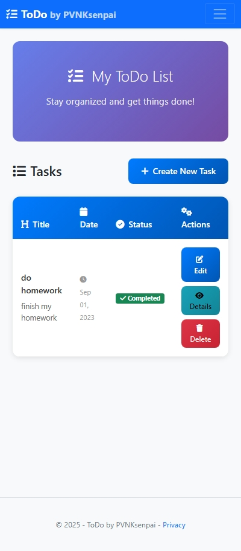
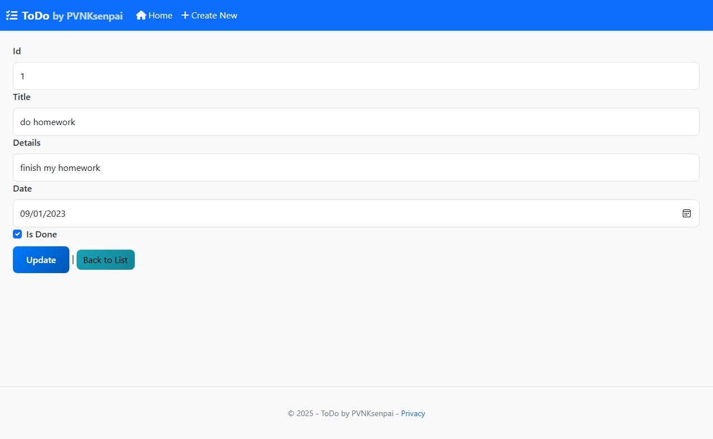

# ToDo (by PVNKsenpai)

A modern, responsive To-Do List web application built with ASP.NET Core MVC, Entity Framework Core, and Bootstrap 5.


## ✨ Features

- **Modern UI Design**: Clean, responsive interface with Bootstrap 5 and FontAwesome icons
- **CRUD Operations**: Create, Read, Update, Delete tasks
- **Status Tracking**: Mark tasks as completed or pending
- **Responsive Design**: Works perfectly on desktop, tablet, and mobile
- **Database Flexibility**: SQLite for development, SQL Server for production
- **E2E Testing**: Automated testing with NUnit and Selenium

## 🖼️ UI Screenshots

### Home Page - Task List

*Modern task list with Bootstrap 5 styling, status badges, and action buttons*

### Create New Task

*Clean form design with FontAwesome icons and responsive layout*

### Mobile Responsive

*Fully responsive design that works perfectly on mobile devices*

### Task Details View

*Detailed view of individual tasks with modern card design*

### Edit Task Form

*Edit form with pre-populated data and validation*

> **Note**: These are real screenshots of the ToDo application running locally. The UI features modern Bootstrap 5 design with FontAwesome icons and responsive layout.

## 🚀 Getting Started

## Prerequisites
- .NET 8 SDK
- Git

## Getting Started
```bash
# Clone
git clone https://github.com/PVNKsenpai/test-project.git
cd test-project

# Restore & build
cd ToDo
dotnet restore
dotnet build

# Run (Development)
# Default launch settings listen on: http://localhost:5137 and https://localhost:7290
# Or run on a custom HTTP port (e.g. 5250):
# dotnet run --no-restore --urls http://localhost:5250

dotnet run --no-restore
```

Open:
- http://localhost:5137/
- https://localhost:7290/ (accept the dev cert warning)
- ToDo page: append `/ToDo` to the base URL

## 🗄️ Database
- Development uses SQLite by default (`Data Source=ToDo_dev.db` in `appsettings.Development.json`).
- Production uses SQL Server via `ConnectionStrings:DefaultConnection` in `appsettings.json`.

Migrations are not needed for SQLite development because the schema is auto-created on startup. If you switch to SQL Server locally, apply migrations:
```bash
dotnet ef database update
```

## Features
- List ToDos
- Create / Edit / Delete
- View details

## 📁 Project Structure
- Controllers: `ToDo/Controllers`
- Views: `ToDo/Views`
- Data: `ToDo/Data`
- Models: `ToDo/Models`

## 🧪 Automation Scripts (NUnit + Selenium)
Example E2E test to create a ToDo and verify it appears in the list. Make sure the app is running (e.g., `http://localhost:5137`) and Chrome is installed.

```csharp
using NUnit.Framework;
using OpenQA.Selenium;
using OpenQA.Selenium.Chrome;

namespace ToDoTests
{
    public class ToDoCRUDTests
    {
        IWebDriver driver;

        [SetUp]
        public void Setup()
        {
            driver = new ChromeDriver();
            driver.Navigate().GoToUrl("http://localhost:5137");
            driver.Manage().Window.Maximize();
        }

        [Test]
        public void CreateToDo_ShouldDisplayInList()
        {
            driver.FindElement(By.LinkText("Create")).Click();
            driver.FindElement(By.Id("Title")).SendKeys("Học kiểm thử");
            driver.FindElement(By.Id("Description")).SendKeys("Ôn lại test case CRUD");
            driver.FindElement(By.CssSelector("input[type='submit']")).Click();

            Assert.IsTrue(driver.PageSource.Contains("Học kiểm thử"));
        }

        [TearDown]
        public void TearDown()
        {
            driver.Quit();
        }
    }
}
```

Run tests with NUnit (example commands):
```bash
# Add test project (if you create a separate test project)
# dotnet new nunit -n ToDo.E2E.Tests
# cd ToDo.E2E.Tests
# dotnet add package Selenium.WebDriver
# dotnet add package Selenium.WebDriver.ChromeDriver
# dotnet test
```

## 🤝 Contributing
PRs welcome. Fork, branch, commit, and open a PR.

## 📄 License
MIT
